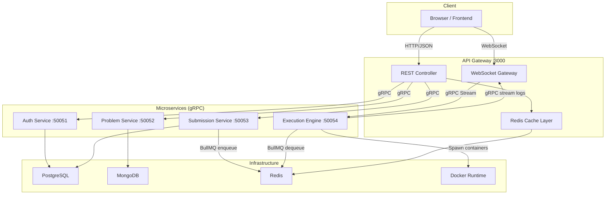
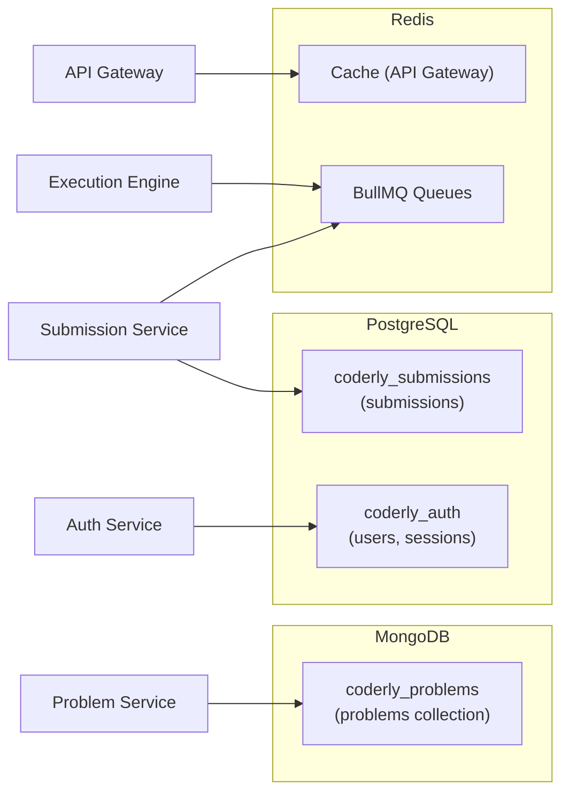

# Coderly — System Architecture

> **Design Pattern**: Microservices · gRPC · Event-Driven · Containerized  
> **Author**: Sahil  

---

## Table of Contents

- [High-Level Overview](#high-level-overview)
- [Architecture Diagram](#architecture-diagram)
- [Service Breakdown](#service-breakdown)
- [Communication Protocols](#communication-protocols)
- [Data Layer](#data-layer)
- [Containerization Strategy](#containerization-strategy)
- [Advantages](#advantages)
- [Disadvantages](#disadvantages)
- [Trade-offs & Design Decisions](#trade-offs--design-decisions)

---

## High-Level Overview

Coderly is a **coding challenge platform** built on a microservices architecture. Users browse problems, write code in an in-browser editor, and receive real-time execution feedback streamed back via WebSockets.

The backend consists of **5 independent NestJS services** communicating over **gRPC**, with an **API Gateway** acting as the single entry point for all client traffic. Asynchronous job processing is handled through **BullMQ** backed by **Redis**, and code execution happens inside **sandboxed Docker containers**.

```
Client ──HTTP/WS──▶ API Gateway ──gRPC──▶ Auth | Problem | Submission | Execution
                         │                                       │
                    Redis Cache                              BullMQ (Redis)
                                                                 │
                                                        Docker Sandbox (code execution)
```

---

## Architecture Diagram



---

## Service Breakdown

### 1. API Gateway (`:3000`)

| Aspect | Detail |
|--------|--------|
| **Role** | Single entry point — REST API + WebSocket server |
| **Protocols** | HTTP/JSON (clients), gRPC (internal), WebSocket (real-time logs) |
| **Key Features** | JWT validation, request routing, Redis caching (problems), CORS |
| **Framework** | NestJS with `@nestjs/platform-express` and `@nestjs/websockets` |

### 2. Auth Service (`:50051`)

| Aspect | Detail |
|--------|--------|
| **Role** | User registration, login, JWT issuance, token validation |
| **Database** | PostgreSQL (`coderly_auth`) |
| **Schema** | `users` table (uuid, username, email, password_hash) + `user_sessions` |
| **Security** | `bcrypt` password hashing, JWT with configurable expiry |

### 3. Problem Service (`:50052`)

| Aspect | Detail |
|--------|--------|
| **Role** | CRUD for coding problems — listing, filtering, pagination |
| **Database** | MongoDB (`coderly_problems`) |
| **Schema** | Document-based: title, slug, difficulty, category, templates (multi-language), test_cases, constraints |
| **Why MongoDB** | Flexible schema for nested templates and test cases that vary per problem |

### 4. Submission Service (`:50053`)

| Aspect | Detail |
|--------|--------|
| **Role** | Create/track code submissions, enqueue execution jobs |
| **Database** | PostgreSQL (`coderly_submissions`) |
| **Schema** | `submissions` table with status lifecycle: `pending → running → accepted/wrong_answer/error` |
| **Queue** | Pushes jobs to BullMQ (Redis) for async processing by the Execution Engine |

### 5. Execution Engine (`:50054`)

| Aspect | Detail |
|--------|--------|
| **Role** | Run user code in sandboxed Docker containers, stream logs back |
| **Sandbox** | Containers run with `--network=none`, memory capped, CPU limited |
| **Languages** | Python, JavaScript, TypeScript, Java, C, C++ |
| **Streaming** | gRPC server-side streaming (`StreamExecutionLogs`) for real-time output |
| **Fallback** | Local child_process execution if Docker is unavailable (dev mode) |

---

## Communication Protocols

| Path | Protocol | Why |
|------|----------|-----|
| Client ↔ Gateway | **HTTP/JSON** | Universal web compatibility |
| Client ↔ Gateway (logs) | **WebSocket** (Socket.io) | Low-latency, bidirectional real-time updates |
| Gateway ↔ Services | **gRPC** (HTTP/2) | Strict typing via Protobuf, low serialization overhead, streaming support |
| Submission → Execution | **BullMQ** (Redis) | Reliable job queue with retries, backoff, and concurrency control |
| Execution → Gateway | **gRPC Streaming** | Server-push of log frames as code executes |

All internal gRPC contracts are defined in a **single shared Protobuf file** (`proto/coderly.proto`), ensuring type-safety across service boundaries.

---

## Data Layer

### Polyglot persistence — each service owns its data



| Database | Services | Used For |
|----------|----------|----------|
| **PostgreSQL** | Auth, Submission | Relational data — users, sessions, submissions (ACID guarantees) |
| **MongoDB** | Problem | Document flexibility — nested templates, test cases, constraints |
| **Redis** | Gateway, Submission, Execution | Caching (5-min TTL), job queues (BullMQ), session management |

---

## Containerization Strategy

All services are containerized with **multi-stage Docker builds** and orchestrated via **Docker Compose**.

```
docker-compose.yml
├── redis:7-alpine          # Cache + job queue
├── postgres:16-alpine      # Auth + Submission databases
├── mongo:7                 # Problem database
├── auth-service            # Built from apps/auth-service/Dockerfile
├── problem-service         # Built from apps/problem-service/Dockerfile
├── submission-service      # Built from apps/submission-service/Dockerfile
├── execution-engine        # Built from apps/execution-engine/Dockerfile (+ docker-cli)
└── api-gateway             # Built from apps/api-gateway/Dockerfile
```

**Key decisions:**
- **Single PostgreSQL instance** with two databases (init script creates both on first boot)
- **Docker socket mounting** for the execution engine (host Docker, not Docker-in-Docker)
- **Named volumes** for data persistence across restarts
- **Health checks** on all infrastructure containers with dependency ordering

---

## Advantages

### 1. Independent Scalability
Each service can be scaled independently based on load. During a contest, you can scale the Execution Engine horizontally without touching the Auth or Problem services.

### 2. Technology Freedom (Polyglot Persistence)
Each service uses the database best suited for its data model:
- **PostgreSQL** for relational integrity (users, submissions with strict schemas)
- **MongoDB** for flexible documents (problems with variable templates and test cases)
- **Redis** for ephemeral, high-throughput data (caching, job queues)

### 3. Fault Isolation
A crash in the Execution Engine (e.g., from malicious code) doesn't bring down the Problem Service or authentication. Services are process-isolated and, in Docker, container-isolated.

### 4. Real-Time Feedback Pipeline
The gRPC streaming + WebSocket pipeline delivers execution logs to the user's browser in real-time — no polling. This creates a responsive, IDE-like experience.

### 5. Secure Code Execution
User code runs in **sandboxed Docker containers** with:
- Network disabled (`--network=none`) — no external requests
- Memory capped (`--memory=256m`)
- CPU throttled (`--cpus=0.5`)
- Time-limited (configurable timeout)

### 6. Queue-Based Decoupling
BullMQ decouples submission creation from code execution. The Submission Service can accept thousands of submissions without blocking, while the Execution Engine processes them at its own pace with retry semantics.

### 7. Type-Safe Internal APIs
gRPC with Protobuf enforces strict contracts between services at compile time. If a field changes in `coderly.proto`, every dependent service must explicitly handle it — no silent JSON deserialization bugs.

### 8. One-Command Dev Environment
`docker compose up --build` spins up the entire stack (all 5 services + 3 databases) in seconds. No manual database provisioning or service-by-service startup.

---

## Disadvantages

### 1. Operational Complexity
8 containers to monitor, debug, and maintain. Log aggregation across services requires tooling (ELK, Loki, or similar). Distributed tracing is harder than a single-process monolith.

### 2. Network Latency Overhead
Every inter-service call is a network hop:
- `Client → Gateway → Auth` for a simple `/auth/me` check adds ~1-3ms per gRPC call
- In a monolith, this would be an in-process function call (~microseconds)

### 3. Data Consistency Challenges
With separate databases, cross-service transactions don't exist. Example: if a submission is created in PostgreSQL but the BullMQ job fails to enqueue, the submission exists but will never execute. Compensating transactions or saga patterns would add complexity.

### 4. Shared Mono-Repo Coupling
All services share a single `package.json` and `node_modules`. This means:
- A dependency update affects all services simultaneously
- Docker images include the **full** dependency tree, even if a service only uses a fraction
- True independent deployability requires further decoupling into separate packages

### 5. Resource Consumption
Running 8 containers (5 Node.js + PostgreSQL + MongoDB + Redis) has significant memory overhead, especially on developer machines. Each Node.js service consumes ~80-150MB of RAM at idle.

### 6. Debugging Distributed Flows
Tracing a single "Run Code" request touches 4 services: Gateway → Submission → Redis → Execution Engine → Gateway (WebSocket). Without correlation IDs and centralized logging, debugging failures across this chain is tedious.

### 7. Docker Socket Security Risk
Mounting `/var/run/docker.sock` into the Execution Engine gives it **full control** over the host Docker daemon. A container escape vulnerability could compromise the host. Production environments should consider alternatives like gVisor, Kata Containers, or a dedicated execution VM.

---

## Trade-offs & Design Decisions

### gRPC vs REST for Internal Communication

| | **gRPC (chosen)** | **REST alternative** |
|---|---|---|
| **Serialization** | Binary Protobuf — smaller, faster | JSON — human-readable, larger |
| **Streaming** | Native server/client streaming | Requires SSE or WebSocket overlay |
| **Type Safety** | Compile-time contracts via `.proto` | Runtime validation only |
| **Debugging** | Harder to inspect with curl/Postman | Trivial with any HTTP tool |
| **Browser Support** | Needs gRPC-Web proxy | Native browser support |

**Decision**: gRPC's streaming support was the clincher — it enables real-time log delivery from the Execution Engine without bolting on a separate streaming mechanism.

---

### BullMQ (Redis) vs Direct gRPC Execution

| | **BullMQ queue (chosen)** | **Direct gRPC call** |
|---|---|---|
| **Reliability** | Persistent jobs survive crashes, automatic retries | Lost if engine crashes mid-execution |
| **Back-pressure** | Natural rate limiting via concurrency config | Engine can be overwhelmed by burst traffic |
| **Complexity** | Extra dependency (Redis), async flow | Simpler, synchronous flow |
| **Latency** | Slight queue delay (~ms) | Immediate |

**Decision**: Queue-based execution provides essential reliability and back-pressure for a system that runs arbitrary user code. The minor latency penalty is negligible compared to the multi-second execution time.

---

### Single PostgreSQL vs Separate Instances

| | **Single instance (chosen)** | **Separate per service** |
|---|---|---|
| **Resource usage** | One container, lower memory | Two containers, higher isolation |
| **Isolation** | Shared process, separate databases | Full process isolation |
| **Operational** | Simpler to manage and back up | More complex, but true independence |

**Decision**: For a dev/staging environment, a single PostgreSQL instance with separate databases is pragmatic. In production, separate instances per service would provide better fault isolation and independent scaling.

---

### Docker Socket vs Docker-in-Docker (DinD)

| | **Socket mounting (chosen)** | **Docker-in-Docker** |
|---|---|---|
| **Security** | ⚠️ Full host Docker access | Nested daemon, more isolated |
| **Performance** | Native speed, shared image cache | Slower, separate storage driver |
| **Complexity** | Simple volume mount | Privileged container, extra config |
| **Image Caching** | Shares host cache (fast pulls) | Cold cache per DinD instance |

**Decision**: Socket mounting is chosen for simplicity and performance. The security concern is mitigated by the fact that spawned code containers already have `--network=none` and resource limits. For production, a dedicated execution VM or sandboxing runtime (gVisor) is recommended.

---

### Mono-Repo with Shared Dependencies vs Separate Packages

| | **Shared package.json (chosen)** | **Independent packages** |
|---|---|---|
| **Setup** | Single `npm install`, simple | Per-service `package.json`, complex |
| **Docker Image Size** | Larger (full node_modules) | Smaller (only needed deps) |
| **Dependency Conflicts** | Higher risk of version conflicts | Isolated, independent versions |
| **Dev Experience** | Easy — one terminal, shared types | Requires workspace tooling (Nx, Turborepo) |

**Decision**: A shared `package.json` prioritizes developer experience during early development. As the platform matures, migrating to a workspace tool (Nx or Turborepo) would enable tree-shaken, per-service dependency trees and faster, more targeted builds.

---

## Summary

Coderly's architecture prioritizes **developer experience**, **real-time user feedback**, and **safe code execution** at the cost of **operational complexity** and **resource overhead**. The microservices pattern is a deliberate investment — it pays dividends as the platform scales to handle concurrent users, diverse programming languages, and eventually, features like contest leaderboards, collaborative editing, and AI-powered hints — all of which can be added as new services without destabilizing existing ones.

The current containerized setup provides a **production-like local environment** that eliminates "works on my machine" problems and makes onboarding new developers a single `docker compose up` away.
