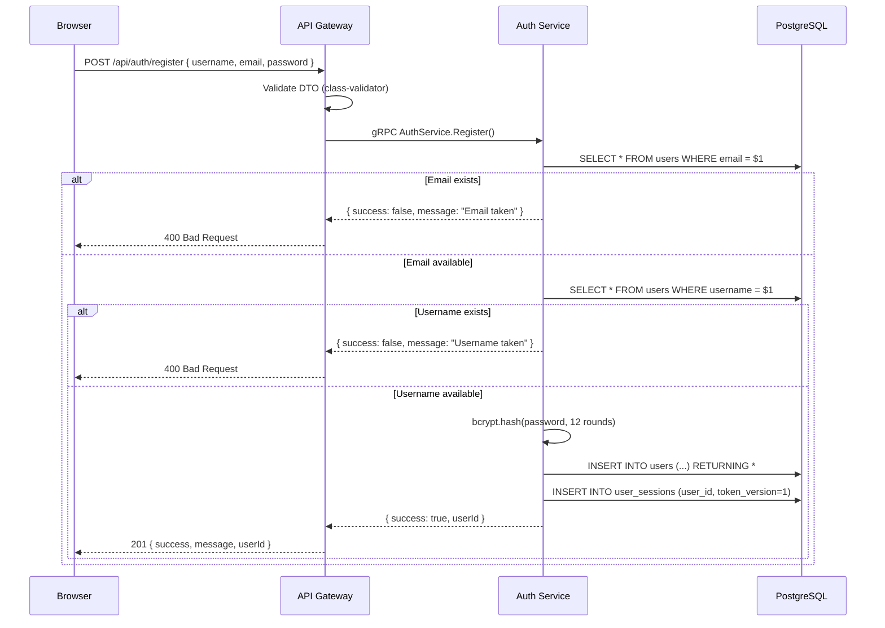
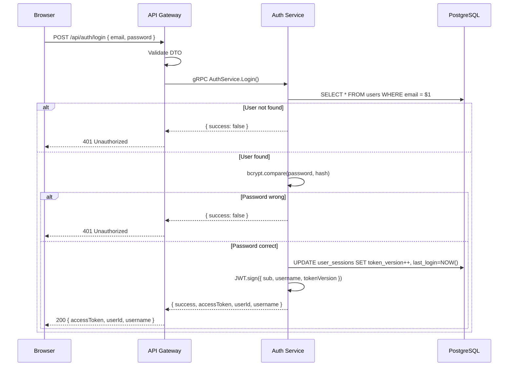
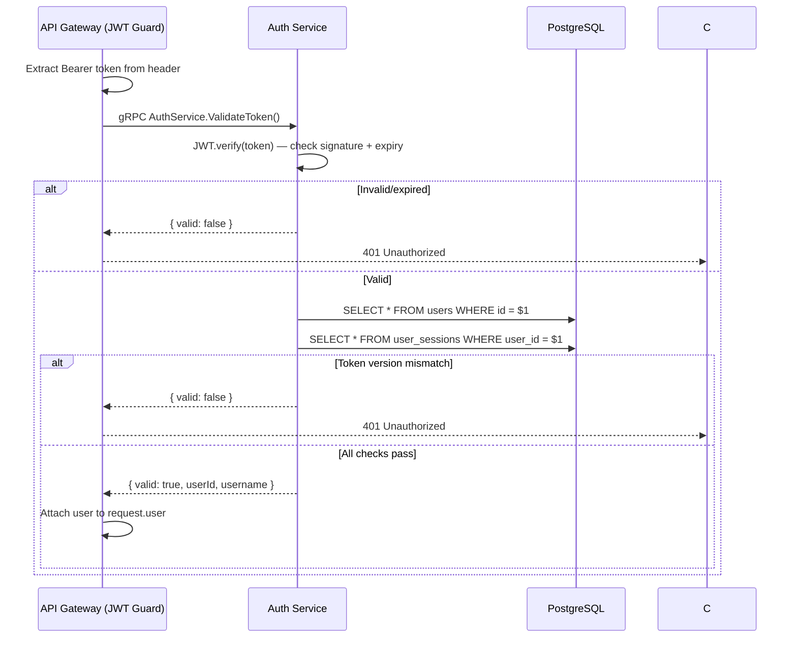
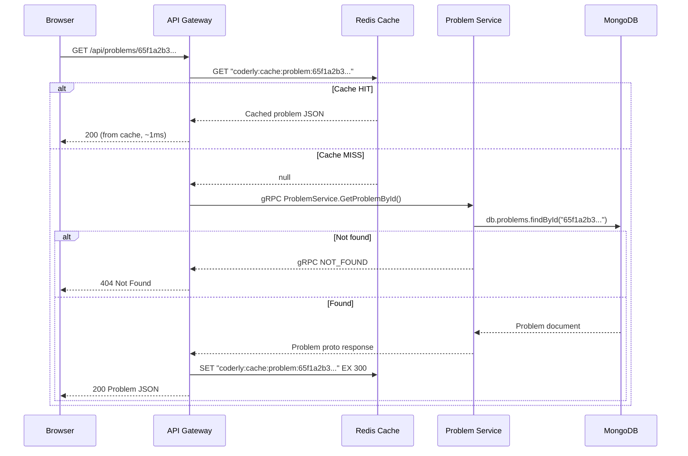
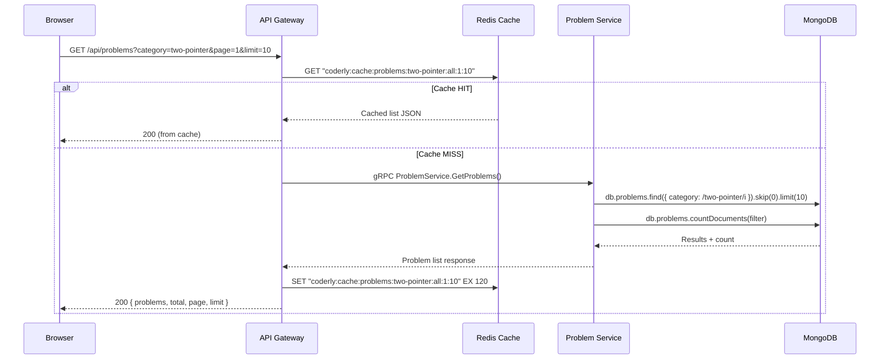
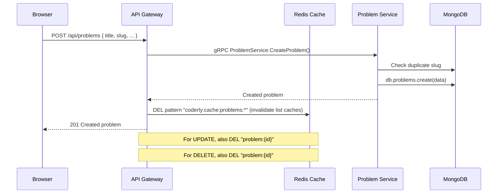
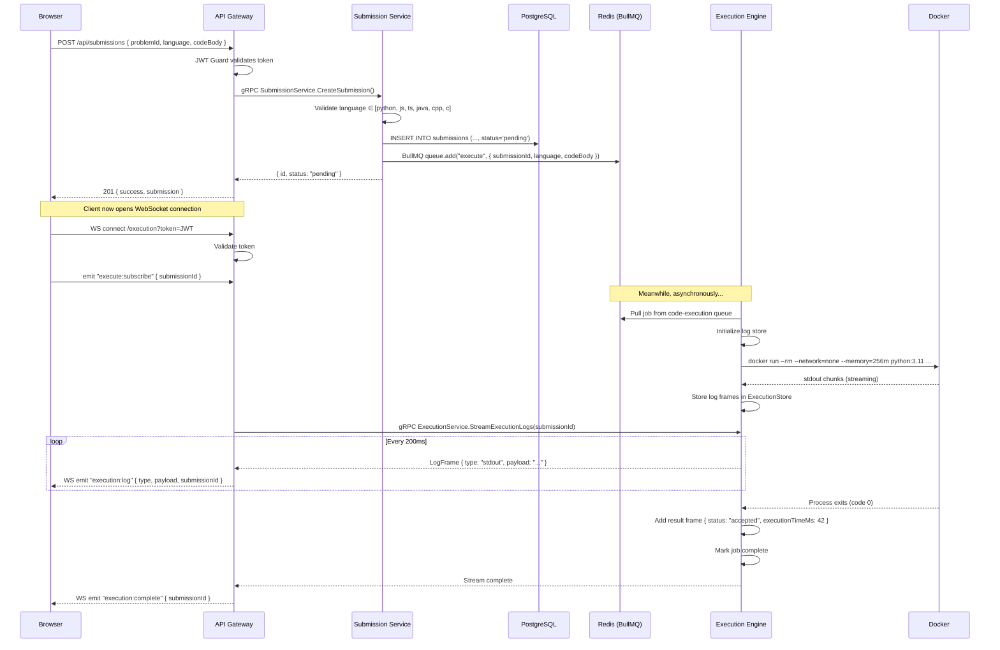
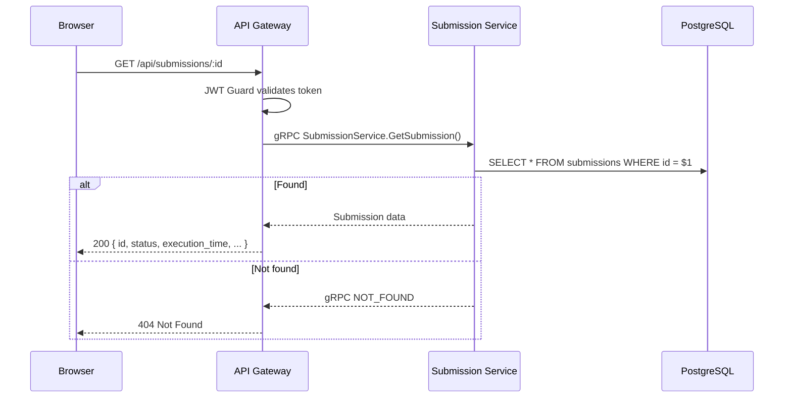
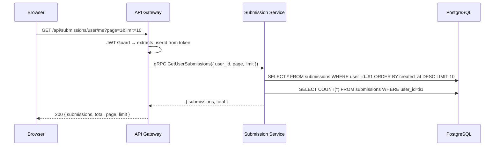

# Coderly — System Flow Document

> Complete flow for every use case. Each section shows the request, every internal stage (caching, gRPC, DB, queue), and the response.

---

## 1. User Registration

**Logic:**
1. Gateway validates request body via `class-validator` (username ≥3 chars, valid email, password ≥6 chars)
2. Gateway calls Auth Service via gRPC `Register()` RPC
3. Auth Service checks for duplicate email → then duplicate username
4. Password is hashed with bcrypt (12 salt rounds)
5. User row inserted into PostgreSQL
6. Session row created with `token_version = 1`
7. Response sent back through the chain

---

## 2. User Login

**Logic:**
1. Find user by email in PostgreSQL
2. Compare plaintext password against stored bcrypt hash
3. Bump `token_version` in `user_sessions` — this invalidates any previously issued JWTs
4. Sign new JWT with `{ sub: userId, username, tokenVersion }`, expiry from `JWT_EXPIRES_IN` env var
5. Return JWT to client

---

## 3. Token Validation (used by JWT Guard)

**Token version check:** When a user logs in again, `token_version` is incremented. Old JWTs carry the old version number and are rejected — this is a simple revocation mechanism without maintaining a blacklist.

---

## 4. Get Problem by ID (with Caching)

**Caching strategy:**
- **Key:** `coderly:cache:problem:{id}`
- **TTL:** 300 seconds (5 minutes)
- **Invalidation:** Cleared when the same problem is updated or deleted
- **Failure mode:** If Redis is down, cache operations fail silently — the request still works, just without caching

---

## 5. List Problems (with Caching)

**Caching strategy:**
- **Key:** `coderly:cache:problems:{category}:{difficulty}:{page}:{limit}`
- **TTL:** 120 seconds (2 minutes — lists change more often)
- **Invalidation:** All list cache keys (`problems:*`) are wiped when any problem is created, updated, or deleted

---

## 6. Create/Update/Delete Problem (Cache Invalidation)

---

## 7. Submit Code ("Run" Button) — The Heart of Coderly

**Full pipeline breakdown:**

| Stage | What Happens | Where |
|-------|-------------|-------|
| 1. HTTP Request | User hits "Run", POST body with code | Browser → Gateway |
| 2. JWT Validation | Guard extracts + validates Bearer token | Gateway (JwtAuthGuard) |
| 3. gRPC Call | Gateway calls SubmissionService.CreateSubmission | Gateway → Submission Service |
| 4. Language Check | Validates language is supported | Submission Service |
| 5. DB Insert | Saves submission with status=pending | Submission Service → PostgreSQL |
| 6. Queue Job | Pushes to BullMQ `code-execution` queue | Submission Service → Redis |
| 7. HTTP Response | Returns submission ID to client | Gateway → Browser |
| 8. WebSocket Connect | Client opens WS, authenticates with JWT | Browser → Gateway |
| 9. Subscribe | Client emits `execute:subscribe` | Browser → Gateway |
| 10. Job Pickup | BullMQ worker dequeues the job | Redis → Execution Engine |
| 11. Docker Run | Spawns container with code, timeouts, limits | Execution Engine → Docker |
| 12. Streaming | stdout/stderr flow: Docker → Engine → gRPC → WS → Browser | Full pipeline |
| 13. Completion | Final result frame, stream closes | Engine → Gateway → Browser |

**Edge cases handled:**
- **Timeout:** If code runs >10s, process is killed, `error` + "Time Limit Exceeded" returned
- **Runtime error:** Non-zero exit code → `error` + "Runtime Error"
- **No Docker:** Falls back to local `child_process` execution (dev mode)
- **BullMQ retry:** Jobs retry once (after 3s) on failure
- **WebSocket auth failure:** Connection rejected with error event
- **Redis down:** Cache operations fail silently, gRPC calls still work

---

## 8. Get Submission Status

---

## 9. Get My Submissions

---

## Error Handling Summary

| Layer | How Errors Are Handled |
|-------|----------------------|
| **Gateway (HTTP)** | Validation errors → 400, Auth errors → 401, Not found → 404, Server errors → 500 |
| **Gateway (WS)** | Auth failure → `error` event + disconnect, Stream failure → `execution:error` event |
| **gRPC (internal)** | `RpcException` with codes: `INVALID_ARGUMENT`, `NOT_FOUND`, `ALREADY_EXISTS` |
| **Database** | Connection pool auto-reconnects, query errors bubble up as 500 |
| **Redis Cache** | Failures are caught silently — the system works without cache, just slower |
| **BullMQ** | Failed jobs retry once after 3s, then marked as failed |
| **Docker** | Timeout kills the process, network isolated, memory capped |
